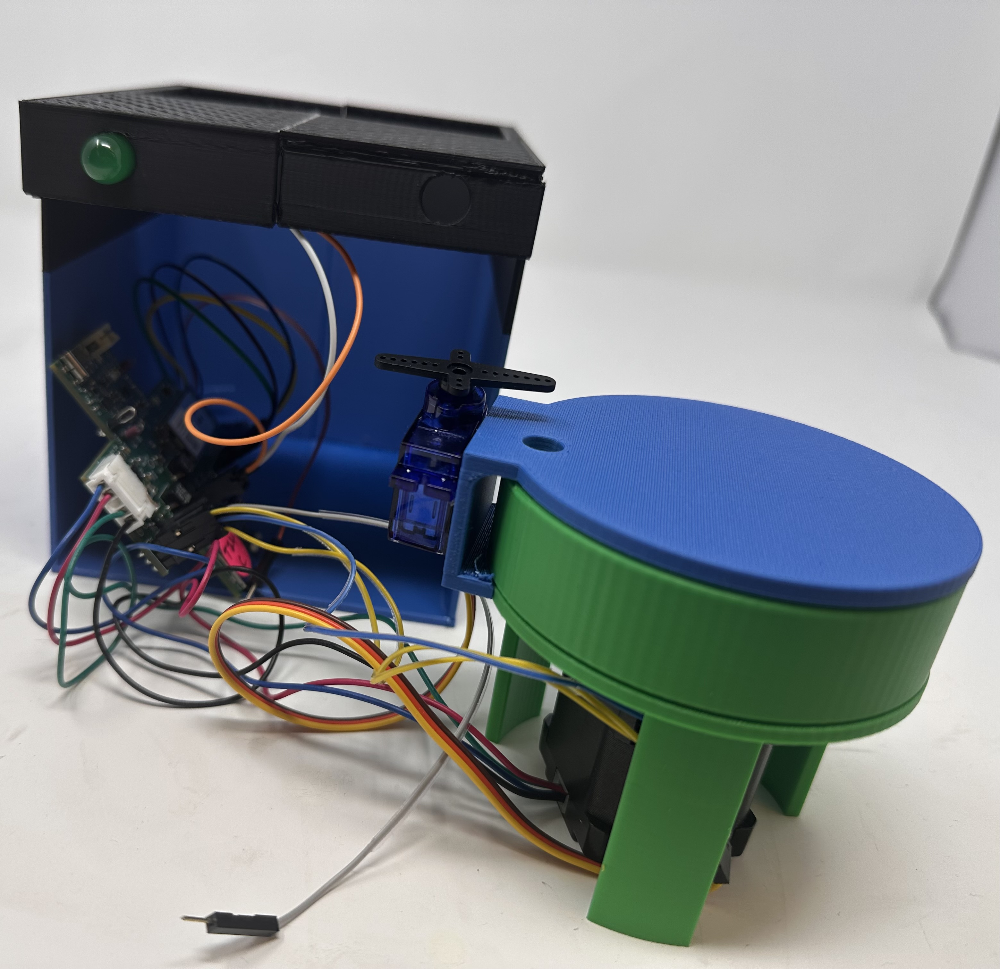
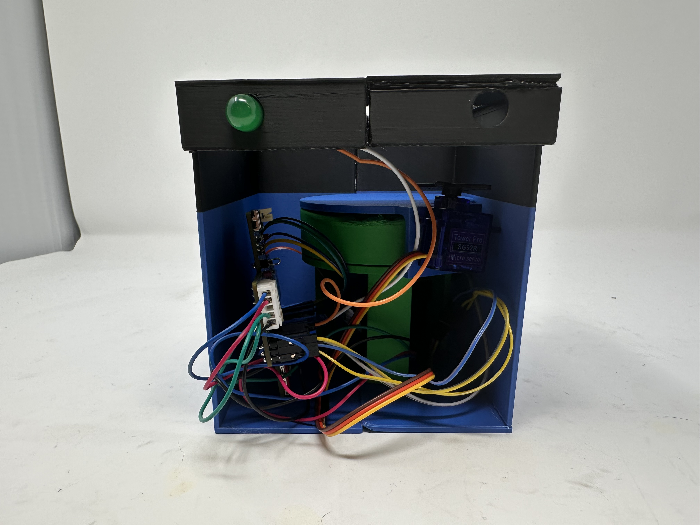
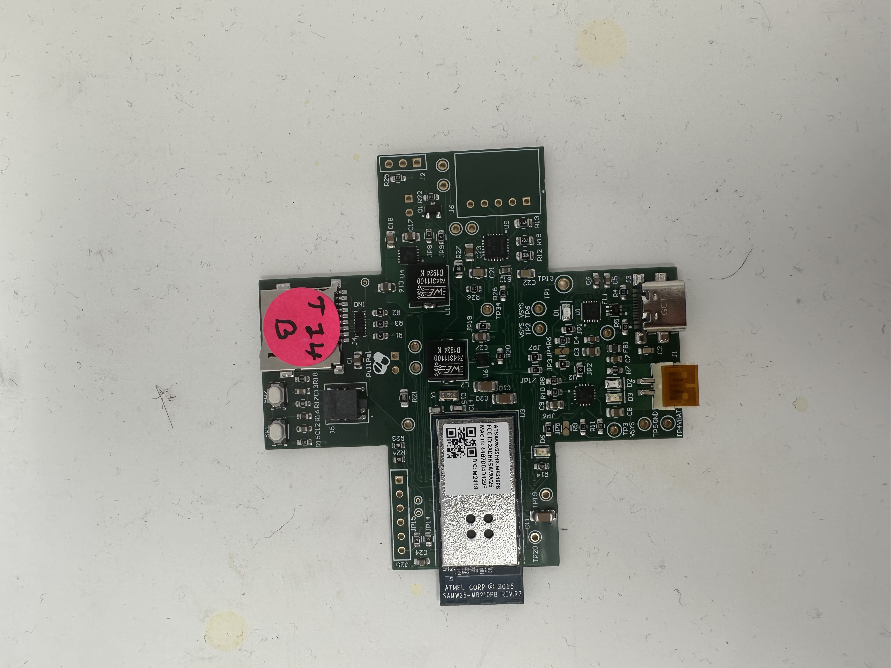
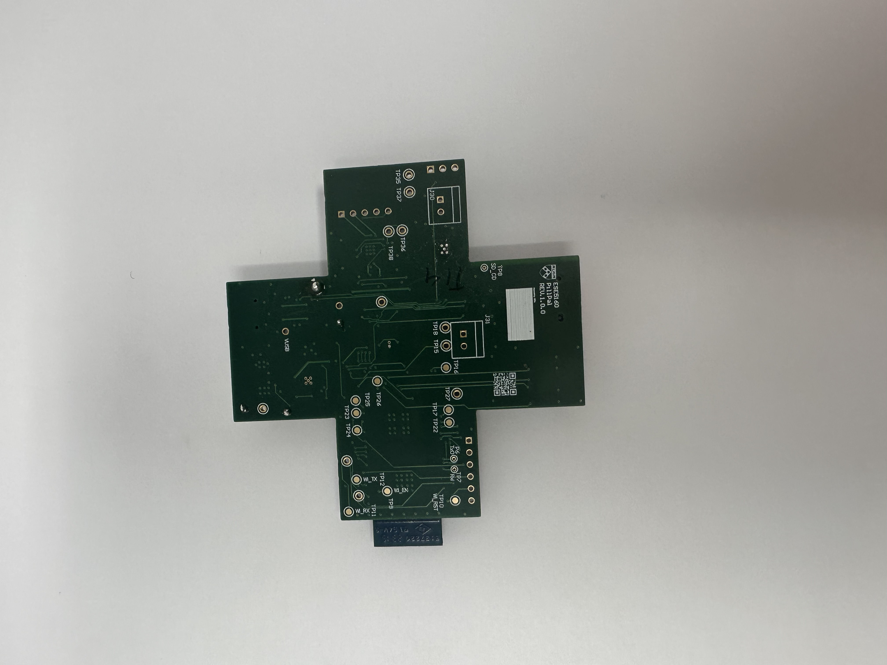
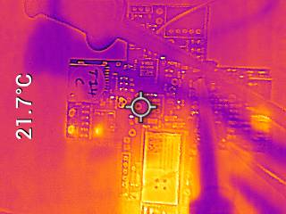
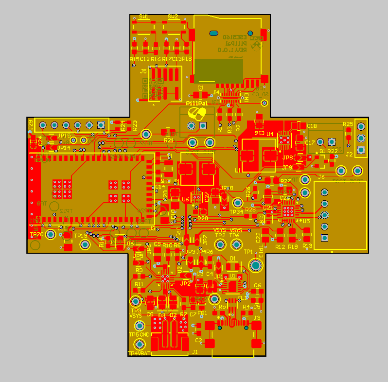
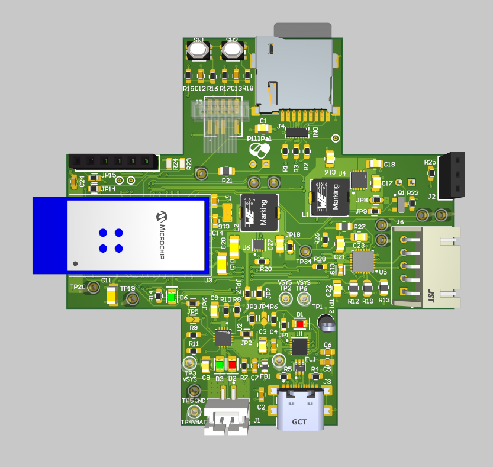
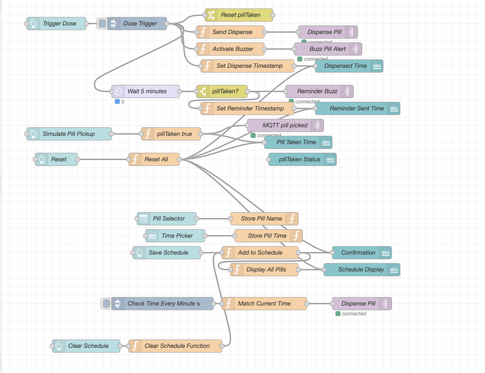
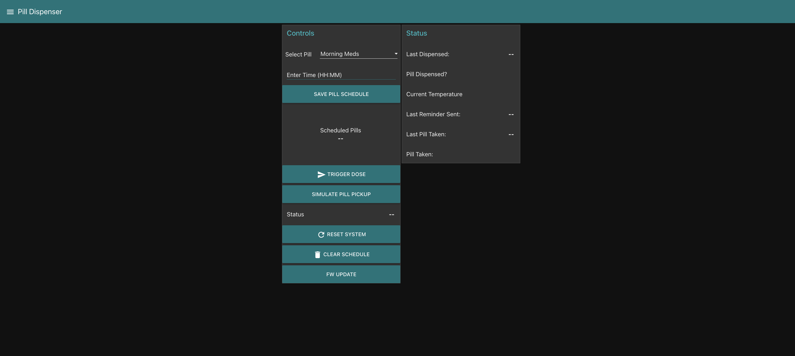
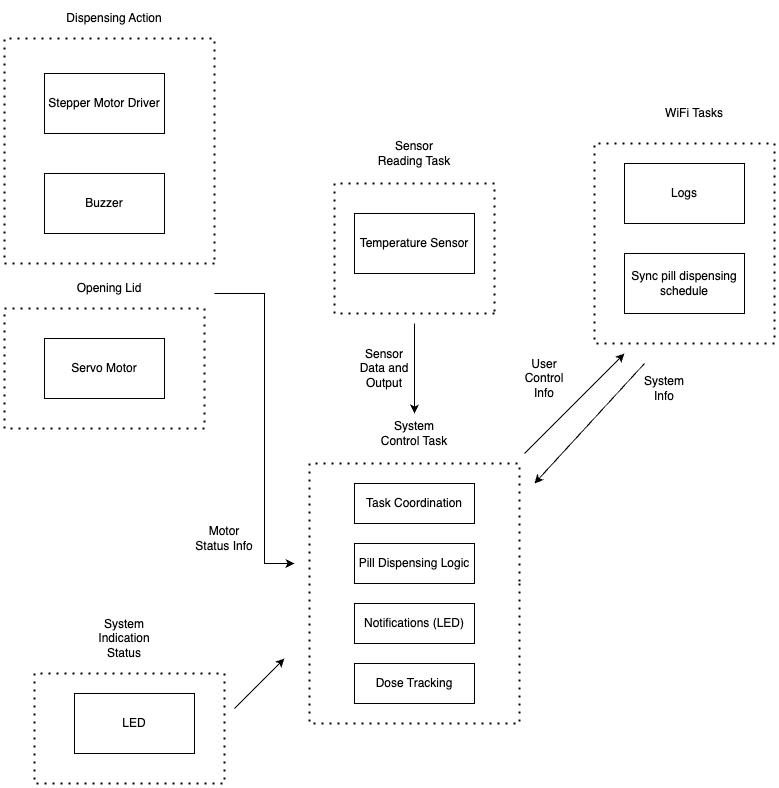

# a14g-final-submission

    * Team Number: 14
    * Team Name: PillPal
    * Team Members: Urvi Haval & Suhaila Shankar
    * Github Repository URL: https://github.com/ese5160/a14g-final-submission-s25-t14-pillpal
    * Description of test hardware: (development boards, sensors, actuators, laptop + OS, etc) 

## 1. Video Presentation

https://youtu.be/ZBLSTaz6bz8

## 2. Project Summary
### Device Description  
#### What is our device?   
We have designed and implemented an IoT-based pill dispenser that works using a stepper motor and a custom pill dispensing mechanism, triggered by scheduled commands via Node-RED. It uses a servo for accessing the main compartment with the pills and integrates an RFID module for scure access control. It also uses a temperature sensor to ensure that the device is kept in optimal conditions.   

#### Inspiration  
The project was inspired by the DOTS program for Tuberculosis observed in India that mandates a particular dosage of pills without missing even a single dose. Missing doses can lead to reverse effects. Monitoring this is usually very hard and in a few cases, patients tend to overdose or underdose. Apart from being a regular pill dispenser, we had to make sure that only a doctor or a medical health provider has access to where all the pills are stored to ensure medical adherence.  

#### Internet Integration  
The device connects to the Internet via Wi-Fi and uses MQTT to communicate with a Node-RED dashboard, allowing users or caregivers to remotely monitor, trigger and adjust dispensing schedules in real time.  

### Device Functionality  
#### Overview  
Our pill dispenser is designed around the SAMD21 microcontroller that coordinates inputs from sensors and outputs to actuators, while maintaining two-way communication with a remote server via Wi-Fi. The device ensures secure, scheduled pill dispensing, remote monitoring, and user interaction through a Node-RED dashboard.  
**Key components**:  
SENSORS:  
- RFID Reader (PN532) connected over Arduino which authenticates users before allowing access to refill or interact with the device.  
- Button on the PCB (PB23) used for manual override or triggering functions locally.  
- Temperature sensor (BMP388) periodically logs ambient temperature for monitoring pill storage conditions.  
  
ACTUATORS:  
- Stepper motor (controlled via DRV8834 Driver on board) which rotates the upper disc to align with the correct pill slot with the dispensing outlet.  
-  Servo Motor controls the opening and closing of the main lid for loading pills.  
- Buzzer and LED provide alerts for dispensing confirmation or attention signals.  
  
CONNECTIVITY:  
- Wi-Fi Module which enables MQTT communication between the PCB and the Node-RED dashboard.  
- MQTT Topics:  
1. **"pill/status"**: Used to publish pill dispensing events.  
2. **"pill/count"**: Used to publish remaining pill count.  
3. **"debug/ota"**: Used to download OTAFU through the Node-RED UI.  
  
POWER SUPPLY:  
- The stepper and servo motors are powered by an on-board regulated 5V supply using a boost converter.  
- The rest of the peripherals and the microcontroller are powered by a regulated 3V3 supply from the on-board buck converter.  
  
SOFTWARE INTEGRATION:  
- FreeRTOS manages real-time task scheduling for servo control, stepper rotation, temperature sensor reading and MQTT communication, ensuring deterministic and responsive behavior.  
- The CLI Debug interface allows developers to issue test commands via the serial monitor during development and maintenance.  
  
HARDWARE DESIGN:  
- Our custom PCB was designed using *Altium Designer*. It integrates all components on a compact and efficient layout, with properly routed traces for I2C, motor control signals and regulated power distribution. Going with the theme of the project, we also made the PCB to be a 'plus' sign.  
  
#### System Block Diagram  

  
### Challenges  
Developing this project involved tackling multiple challenges accross firmware development, hardware debugging and full system integration. Some of the most significant roadblocks and our approaches to resolving them are outlined below.  
  
1. PN532 I2C communication: One of the earliest and most time-consuming challenges in firmware arose during the integration of the PN532 RFID reader via I2C. While writing to the sensor worked reliably using the FreeRTOS-based I2C driver, we consistently missed two packets while reading back from it. We spent quite a lot of time debugging and analyzing on the SALAE Logic Analyzer, tried changing the on-board pull up resistors. Since we were using the breakout board for PN532, the datasheet was not of much help as it was meant for the SOC. The problem was compounded by the lack of thorough documentation or working examples of a minimal I2C-based PN532 driver written in pure C—most open-source implementations either used SPI or were heavily abstracted in C++ (e.g., Adafruit’s Arduino library).  Eventually, in the interest of time and project stability, we decided to offload the RFID functionality to a separate Arduino Nano. This external board successfully communicated with the PN532 using a well-supported library and then forwarded authentication results over UART to the main SAMD21 controller.  

2. Boost Converter Failure: We designed an onboard boost converter circuit using the TPS6123 IC to power certain components from a lower voltage source. However, during early hardware testing, the circuit failed to deliver the expected output voltage. Upon investigation using an electronic load (eload) and multimeter measurements, we discovered that the ground pins on the TPS6123 were inadvertently floating—left electrically unconnected to the board’s main ground plane. To address this, we manually soldered jumper wires to tie the floating ground points to the main ground. Although this initially appeared to resolve the issue, it caused a massive and uncontrolled current draw, ultimately blowing the boost converter. Hence we took the decision to use an external 5V DC supply.  
  
### Prototype Learnings  
Building and testing this prototype provided valuable insights across hardware design, firmware development, and system-level decision-making. Through iterative development and troubleshooting, we identified both best practices and areas for improvement.  
**Key Lessons Learnt:**  
1. While the PN532 RFID module offered robust features, its complexity and lack of C-based I2C documentation slowed our progress significantly. In hindsight, choosing a simpler RFID reader or integrating the module directly onto the PCB instead of using a breakout board would have reduced wiring errors, saved space, and improved stability.  
2. During FreeRTOS integration, we initially underestimated the memory requirements for tasks like Wi-Fi, I2C, and servo control. These tasks, especially when using semaphores and queues, require careful tuning of stack sizes and heap allocation. We learned to regularly monitor uxTaskGetStackHighWaterMark() and adjust configTOTAL_HEAP_SIZE early in development to prevent obscure runtime crashes.  
3. One of the most important takeaways was learning when to stop pursuing a dead-end and shift to a viable workaround. Rather than getting stuck debugging low-level I2C read issues with the PN532, we made the decision to offload the RFID task to a dedicated Arduino. This pivot allowed us to maintain progress and demonstrated the value of modular, flexible architecture in embedded design.  

**What we'd do differently**:  
- Opt for a simpler or more well-documented RFID solution with native MCU support and potentially integrate it directly into the custom PCB.  
- Allocate more time early on for testing task stack sizes and overall heap usage to avoid late-stage integration issues.  
- Prioritize pragmatic engineering and spending less time on unsolved problems and being quicker to adopt alternate paths when necessary.  

### Next steps and takeaways  
#### Next steps to improve the project  
1. **Enhancing the Node-RED dashboard**: The current UI supports basic control, but it can be made far more interactive. Future improvements include adding pill scheduling via a software-based RTC, supporting multiple daily dispensing times, and dynamically updating the remaining pill count. Enhancing the interface with custom CSS would also improve usability and accessibility.  
2. **Simplifying RFID hardware integration**: Instead of relying on a bulky breakout board and an Arduino for RFID handling, future iterations could include a simpler I2C-compatible RFID module (like the SparkFun Qwiic RFID) that can be directly integrated into the main PCB. This reduces wiring complexity, power consumption, and form factor.  
3. **Refining task synchronization and System Integration**: While the prototype runs all subsystems, better task coordination using semaphores better (e.g., signaling between the button, servo, and stepper tasks) would make the system more efficient and deterministic under FreeRTOS. A more structured communication scheme would also reduce the likelihood of task starvation or conflicts.
  
#### What we learned during ESE5160   
Throughout the ESE5160 course, we gained practical and theoretical skills essential to embedded system development.  
1. Firmware Design and RTOS Concepts: We learned how to structure embedded applications using FreeRTOS, manage concurrency using tasks, queues, and semaphores, and debug common issues like stack overflows and heap exhaustion.  
2. Peripheral and Driver Integration: Assignments and lectures taught us how to interface with hardware components such as LEDs, servos, buttons, I2C sensors, and motor drivers through low-level drivers and interrupt-safe communication patterns.  
3. Networking and IoT Protocols: Implementing MQTT and integrating with a cloud-based Node-RED dashboard taught us how to design real-world IoT applications involving secure data exchange and remote control.  
4. System-Level Debugging and Design Thinking: Most importantly, we learned how to debug complex hardware-software interactions and make trade-offs between ideal and practical solutions, especially during our prototype’s challenges.  

### Project Links  
**Link to Node-RED instance:** http://135.119.168.251:1880/ui/#!/1?socketid=zufB0bCCymFWlRAdAAC7  
**Link to PCBA:** https://upenn-eselabs.365.altium.com/designs/8B70E409-2835-43B1-999B-2FA11EA3B7DD#design

## 3. Hardware & Software Requirements  
### Hardware Requirements Validation

| ID       | Requirement Description                                                                 | Status       | Validation Method                                                                 |
|----------|------------------------------------------------------------------------------------------|--------------|-----------------------------------------------------------------------------------|
| HR 01    | Project uses the SAMW25 microcontroller module                                           |  Met        | Verified via firmware check / chip ID.                                            |
| HR 02    | An RFID reader shall be used for access control. The reader shall authenticate RFID tags at a maximum distance of 5 cm and communicate with the microcontroller via I2C.                                           |  Partially Met | Range tested with ruler. Communication verified via I2C ACK/NACK and tag UID.    |
|HR 03 | If the RFID tag matches the reader, the main compartment shall open, which is controlled by a servo motor. | Met | The servo opens and closes the slot for inputting the pills.
| HR 04    | The pill will be dispensed using a carousel design. A rotating disc is aligned with a dispensing chute. The disc rotates using a stepper motor to position the correct slot over the chute at the scheduled time.   | Met   | Tic-Tac placed for experimenting is dispensed.             |
| HR 05    | The device shall include a buzzer for audio notifications. The buzzer shall produce a sound output of at least dB at ? cm and shall be activated for dose alerts.                                                       |  Partially Met | Buzzer tested. dB output needs measurement at 10 cm using phone dB meter.        |
| HR 06    | A Lithium Ion Cylindrical Battery - 3.7V, 2200mAh shall be used as the power source. The battery shall be parallely connected to a Boost Convert (6V) and a Buck Converter (3.3V).                                   |  Partially Met        | Multimeter used to verify 3.3V rail. Performed e-load testing as well. Boost converter however does not work due to DRC errors in the PCB design. Used an external 5V DC supply.                                     |
| HR 07    | The enclosure and carousel dispensing mechanism should be 3D printed.            |  Met        | Measured dimensions. Lid and mechanism assembled as per spec.                    |
| HR 08    | The pill dispenser shall use 802.11 b/g/n Wi-Fi for communication with cloud services.                                      |  Met        | Verified MQTT communication with Node-RED via serial logs.                       |
| HR 09    |  An LED shall indicate dose alerts.                                             |  Met        | LEDs trigger on stepper motor turning battery logic.                                  |
| HR 10    | A load cell/force sensor should be placed at the end of the dispenser to check if the patient picks up the pill                                                   |  Not Met | Was not a mandatory requirement.                      |

### Software Requirements Validation  
## Software Requirements Validation

| ID       | Requirement Description                                                                 | Status       | Validation Method                                                                 |
|----------|------------------------------------------------------------------------------------------|--------------|-----------------------------------------------------------------------------------|
| SRS 01   | A notification shall be sent to the patient when they need to take their medication on Node-RED.                                        |  Met        | Verified on Node-RED task.                                      |
| SRS 02   | A reminder notification shall be sent in 5 minutes if the patient has not taken their medication.                                 | Not Met        | Future scope |
| SRS 03   | A counter shall keep track of the number of pills left in the dispenser and alert the patient. The counter subtracts the pill amount every time the stepper motor dispenses the pill.                                    |  Met        | Decrement logic on stepper task; MQTT alert sent. Verified on Node-RED          |
| SRS 04   | A schedule shall be set by the provider to send reminders for taking pills.                                                     | Partially Met        | Practitioner can set schedule on Node-RED dashboard. Future scope to integrate it with the hardware.                       |
| SRS 05   | An MQTT broker shall communicate with Node-RED for sending alerts                                              |  Met        | Verified with payloads on "pill/alert" and "pill/status" topics.                |
| SRS 06   | Node-RED UI dashboard shall displays pill count, status, and connectivity                      |  Met        | Dashboard fields update on MQTT publish from MCU.                                |                                       
| SRS 07   | A FreeRTOS task shall read temperature data every 10 seconds and publish it via MQTT     |  Met        | Temperature task uses vTaskDelay(10000/portTICK_PERIOD_MS). MQTT publish verified on topic "pill/temp". Reading accuracy validated by comparing with ambient temperature. |
| SRS 08   | The system shall run all tasks (dispense, sensor, comms, alerts) concurrently under FreeRTOS |  Partially Met | Tasks are created and run under FreeRTOS. Validation via serial logs and functional testing. However, system occasionally freezes or stops responding, indicating potential stack/heap mismanagement or race condition. Debugging ongoing. |

## 4. Project Photos & Screenshots

## Codebase

- A link to your final embedded C firmware codebases: Github
- A link to your Node-RED dashboard code: 
- Links to any other software required for the functionality of your device
